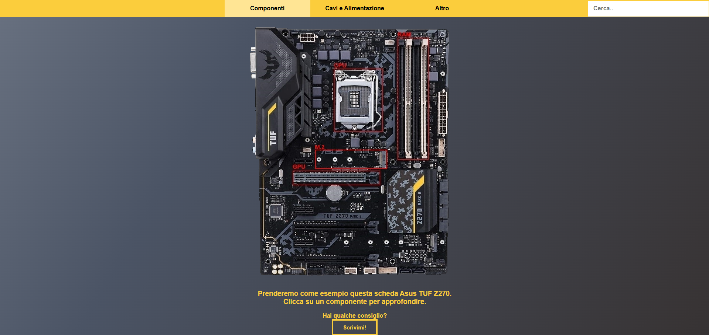
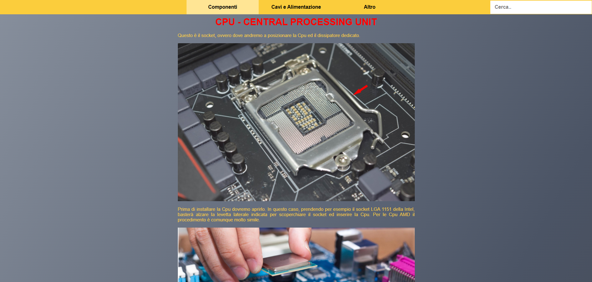
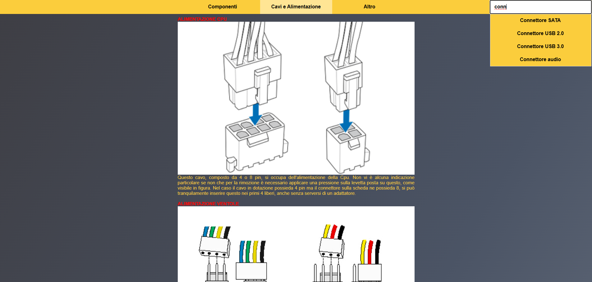

# JS Motherboard

An interactive view helpful to understand and get to know a motherboard in all of its parts.

## 🔗 Live Demo

Explore the live version here: [tomasoni-mobo.infinityfreeapp.com](https://tomasoni-mobo.infinityfreeapp.com)

## Technologies Used
- HTML5
- CSS3
- JS

## Screenshots

